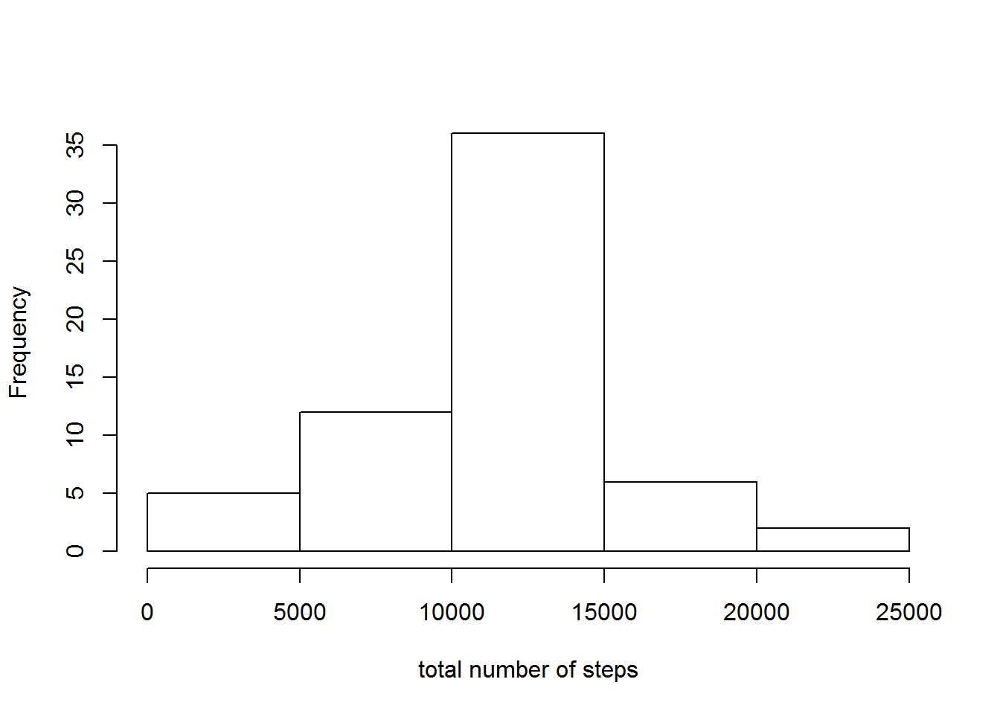

##Loading and preprocessing the data

```r
data<- read.csv("activity.csv")
```

##What is mean total number of steps taken per day?
Histogram of total number of steps taken per day:

```r
x <- aggregate(steps~date,data,sum)
hist(x[,2], xlab = "total number of steps per day", main = "")
```


Mean of total number of steps taken per day:


```r
mean(x[,2])
```

```
## [1] 10766.19
```

Median of total number of steps taken per day;


```r
median(x[,2])
```

```
## [1] 10765
```

##What is the average daily activity pattern?


```r
steps.interval <- aggregate(steps ~ interval, data=data, FUN=mean)
plot(steps.interval$interval, steps.interval$steps, type="l", xlab = "interval",
     ylab = "average number of steps")
```


5min interval with maximum number of steps (interval,steps)


```r
steps.interval$interval[which.max(steps.interval$steps)]
```

```
## [1] 835
```


##Imputing missing values

Calculate and report the total number of missing values in the dataset (i.e. the total number of rows with NAs)


```r
sum(is.na(data$steps))
```

```
## [1] 2304
```

Devise a strategy for filling in all of the missing values in the dataset. The strategy does not need to be sophisticated. For example, you could use the mean/median for that day, or the mean for that 5-minute interval, etc.

I will use the means for the 5-minute intervals as fillers for missing values.

Create a new dataset that is equal to the original dataset but with the missing data filled in.


```r
activity <- merge(data, steps.interval, by="interval")
nas <- is.na(activity$steps.x)
activity$steps.x[nas] <- activity$steps.y[nas]
activity <- activity[,c(1:3)]
```

Make a histogram of the total number of steps taken each day and Calculate and report the mean and median total number of steps taken per day.


```r
y <- aggregate(steps.x~date,activity,sum)
hist(y[,2], xlab = "total number of steps", main = "")
```



After filling, Mean of total number of steps taken per day:


```r
mean(y[,2])
```

```
## [1] 10766.19
```

After filling, Median of total number of steps taken per day:


```r
median(y[,2])
```

```
## [1] 10766.19
```

##Are there differences in activity patterns between weekdays and weekends?

Create a new factor variable in the dataset with two levels -- "weekday" and "weekend" indicating whether a given date is a weekday or weekend day.


```r
daytype <- function(date) {
    if (weekdays(as.Date(date)) %in% c("ÐÇÆÚÁù", "ÐÇÆÚÈÕ")) {
        "weekend"
    } else {
        "weekday"
    }
}
activity$daytype <- as.factor(sapply(activity$date, daytype))
```

Make a panel plot containing a time series plot (i.e. type = "l") of the 5-minute interval (x-axis) and the average number of steps taken, averaged across all weekday days or weekend days (y-axis).


```r
par(mfrow=c(2,1))

weekdayactivity<- subset(activity, daytype =="weekday")

z <- aggregate(steps.x ~ interval,data=weekdayactivity,FUN=mean)

weekendactivity<- subset(activity, daytype =="weekend")

w <- aggregate(steps.x ~ interval,data=weekendactivity,FUN=mean)


plot(z$interval, z$steps.x,type="l", xlab = "interval", ylab = "average number of steps", main = "weekday")

plot(w$interval, w$steps.x,type="l", xlab = "interval", ylab = "average number of steps",main = "weekend")
```


